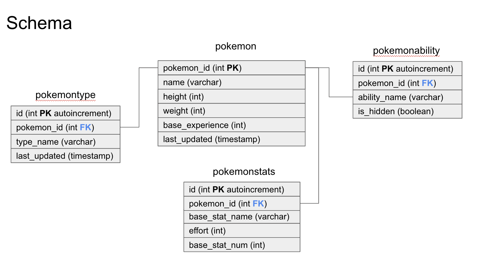

# Pokemon Crawler

A simple Pokemon API built on the Django Rest Framework.
This app interacts with the [PokeAPI](pokeapi.co) to fetch and store Pokemon data in a postgres database.

## Getting started

Download [Docker Desktop](https://www.docker.com/products/docker-desktop/) for Mac or Windows. Docker Compose will be automatically installed.

**Start the server**:

- `docker-compose up`

**Install dependencies**:

- `docker-compose exec web python -m pip install -r requirements.txt`

**Run migration**:

- `docker-compose exec web python manage.py makemigrations pokemons`
- `docker-compose exec web python manage.py migrate`

To create or update pokemons:

- `docker-compose exec web python manage.py update-pokemon-data`

**Connect to postgres**

- `docker-compose exec db psql --username=postgres`

**Run the scheduler**

- `docker-compose exec web python -m celery -A app beat -l info`
  The schedule can be changed in the `CELERY_BEAT_SCHEDULE` block in `settings.py`.

## Use the API

**Try these commands**:

- `http GET http://0.0.0.0:8000/all-pokemons`
- `http GET http://0.0.0.0:8000/pokemon/<pokemon_name>`

**Or Run the app**: [0.0.0.8000](0.0.0.8000)

- `/all-pokemons`: returns all pokemons names
- `/pokemon/<pokemon_name>`: returns a pokemon's data

## DB tables

- `pokemons_pokemon`
- `pokemons_pokemonability`
- `pokemons_pokemontype`
- `pokemons_pokemonstats`

## Tests

Run tests: `docker-compose exec web python manage.py test`

## Explainer

### Schema Design:

I designed my schema keeping in mind it will be mostly used for **reads** - with only occasional **writes** - meaning the number of joins would impact query performance. Whilst some level of normalisation was required to avoid redundancies, I decided not to extensively normalise the schema:

- Pokemon main characteristics are stored in the `pokemons_pokemon` table
- The pokemon_id is used as a foreign key in the following tables:
  - Pokemon abilities are stored in the `pokemons_pokemonability` table.
  - Pokemon types are stored in the `pokemons_pokemontype` table.
  - Pokemon stats are stored in the `pokemons_pokemonstats` table.

I could certainly have normalised further more and have tables to hold ability names, type names, stat names and refer back to them via a foreign key in the tables above, however based on the current size of the Pokemon data, the space saving would be minimal (I estimated this at ~0.09 MB).

**_Note: This is my first time using Django and I haven’t figured out how to define table names, meaning I appreciate that my table names may not be very conventional!_**

**_Also, the challenge brief requires to get the description, but I couldn’t find this field in the pokeAPI response._**

### App Architecture:

I opted for a simple API with 2 endpoints:

- `/all-pokemons`: `GET` request fetching all pokemon names. Response is a simple JSON object with a list of pokemon names.
- `/pokemon/<pokemon_id>`: `GET` request fetching a given pokemon data. Response is a JSON object with the Pokemon data (JSON seemed to be the best option here as it can be very easily extended if we were to fetch additional data).

I initially opted for a 3rd endpoint to update the data (i.e. a `GET` request to the `/update-pokemon-data` endpoint would trigger the update and return the update result as a response (i.e. successful or not)). However, I ended up finding this confusing and a bit of a REST anti pattern in some ways. I eventually opted for a command that can be run from the command line. I added some logs so that the person triggering the update can get some feedback on the update progress.

### Development:

- To create or update pokemons, I used Django `update_or_create` built-in method, which is ideal for this use case as it acts like an `UPSERT`.

- A few things of note regarding the `update-pokemon-data` command:

  - It makes a couple of API calls at the beginning to retrieve the list of pokemon IDs, so that each pokemon/<pokemon_id> endpoint can be called to fetch the Pokemon data. This is necessary because ID numbers are not linear: on this day, there are 1281 pokemons. Their IDs start at 1, run until 1010, and resume at 10001.

  - To maintain data integrity and consistency, a Pokemon update is processed as a transaction, i.e. all the related data for a Pokemon is updated atomically: either all the changes are committed, or they are rolled back to prevent partially accurate data from being displayed.

- I created my endpoints to fetch Pokemon data using the Django REST Framework and
  and its Serializers, as they have the advantage of converting query sets to Python datatypes (e.g. a dictionary) that can be rendered into `JSON`.

- I also implemented a scheduler running with Celery. It schedules the `update_pokemon_task` to run daily at 12.00AM (i.e. a time where there is less traffic - at least in this region).

- Being a Django first time user, there are things I haven’t quite figured out, such as returning a `JSON` response for `404`. The content is currently returned as text/html and I haven’t found how to make it return a `JSON`. This is not a behaviour I would want to implement and I would want to be consistent with the standard response `JSON` format.

### Testing:

- I created a few unit tests for the update_pokemon_data command.
- I also created a few integration tests for the views.

### With more time, I would have considered:

- Implement asynchronous or parallelised execution of the `update-pokemon-data` command (would increase speed of processing and make it more scalable).
- Implementing deletions of Pokemons that don’t exist anymore (if this is a thing).
- Handling exceptions in a less generic way.
- Testing exceptions.
- Implementing a small CI/CD pipeline (run tests, build, deploy)
